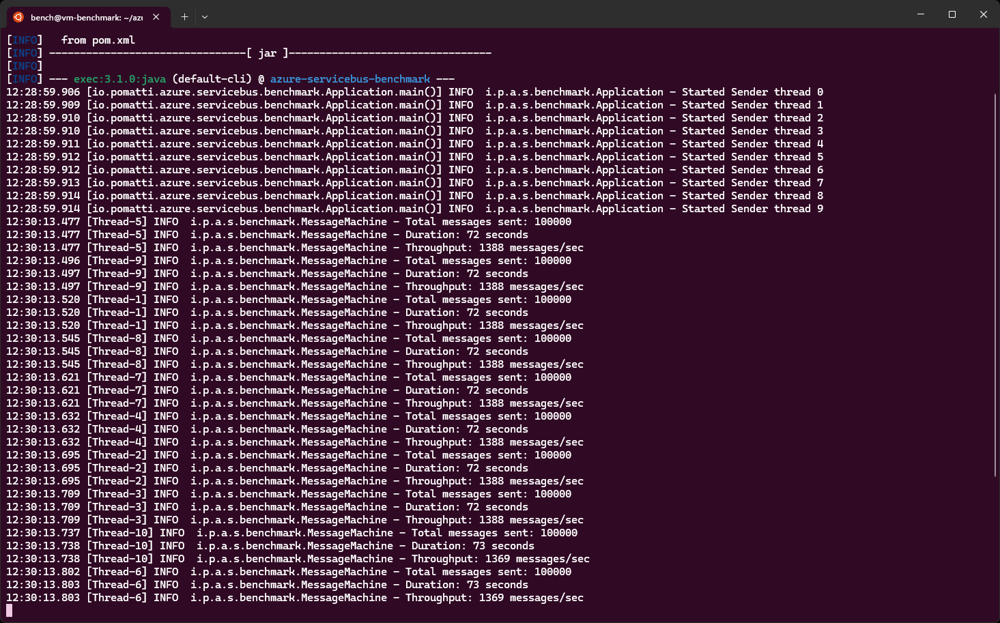
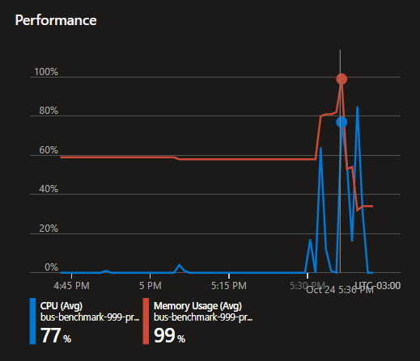

# Azure Service Bus - Performance Benchmark

Benchmarking the performance of Azure Service Bus using the Java SDK.

## 💻 Local Development

Use this section to run the code locally prior to running it in the cloud.

Start by creating the Service Bus namespace:

```sh
az deployment sub create \
  --location brazilsouth \
  --template-file azure/dev/main.bicep \
  --parameters rgLocation=brazilsouth
```

Get the connection string for the namespace:

```sh
az servicebus namespace authorization-rule keys list -g "rg-servicebus-benchmark-dev" --namespace-name "bus-benchmark-999-dev" --name "RootManageSharedAccessKey" --query "primaryConnectionString" -o tsv
```

Create the `app.properties` in the root folder from the template:

```sh
cp config/template.app.properties app.properties
```

Update the `app.servicebus.connection_string` property with the real connection string.

Install the latest stable Java:

```sh
sdk install maven
sdk install java 17.0.7-tem
```

Start the app:

```sh
mvn install
mvn exec:java -Dreactor.schedulers.defaultBoundedElasticSize=100
```

> ℹ️ Due to [this known issue](https://github.com/Azure/azure-sdk-for-java/issues/30483), `defaultBoundedElasticSize` needs to be set for Reactor. Value must be greater than "maxConcurrentCalls".


## 🚀 Cloud Benchmark

Run the benchmark in the cloud with a Premium namespace.

Create the jump box VM for dedicated performance. You'll run the client from this machine.

```sh
az vm create -n "vm-benchmark" -g "rg-servicebus-benchmark-premium" --location "brazilsouth" --image "Ubuntu2204" --custom-data cloud-init.sh --size "Standard_D8s_v4" --public-ip-sku "Standard"
```

Check if the cloud-init script executed correctly:

```sh
ssh <user>@<publicIp>

cloud-init status
```

Get the application code from GitHub via a release archive or cloning (requires login).

Create the **Premium** namespace:

```sh
az deployment sub create \
  --location brazilsouth \
  --template-file azure/premium/main.bicep \
  --parameters rgLocation=brazilsouth
```

Get the connection string:

```sh
az servicebus namespace authorization-rule keys list -g "rg-servicebus-benchmark-premium" --namespace-name "bus-benchmark-999-premium" --name "RootManageSharedAccessKey" --query "primaryConnectionString" -o tsv
```

To control Java memory and JVM configurations:

```sh
export MAVEN_OPTS="-Xms256m -Xmx16g"
```

Download the application code:

```sh
curl -L https://github.com/epomatti/azure-servicebus-performance-benchmark/archive/refs/tags/v0.0.1.tar.gz -o client.tar.gz
tar -xf client.tar.gz
```

From the application root, create the properties file:

```sh
cp config/template.app.properties app.properties

# Edit with the real connection string of the Premium namespace
nano app.properties
```

Change the application properties of the client for a high volume load test. Example:

```
app.message_quantity=1000000
```

Run the application:

```sh
mvn install
mvn exec:java -Dlogback.configurationFile="logback-benchmark.xml" -Dreactor.schedulers.defaultBoundedElasticSize=1200
```

## 📈 Benchmarking Results

Average numbers collected during the tests:

| Tier           | Message Units | Send mode | Messages / Sec |
|----------------|---------------|-----------|----------------|
| Premium        | 1x            | Single    | 5,000          |
| Premium        | 1x            | Batch     | 10,000         |


Sample:



Namespace resources:



## References

- [Service Bus Messaging Exceptions](https://learn.microsoft.com/en-us/azure/service-bus-messaging/service-bus-messaging-exceptions)
- [Service Bus Java SDK 7.11.0 Javadocs](https://azuresdkdocs.blob.core.windows.net/$web/java/azure-messaging-servicebus/7.11.0/index.html)
- [Service Bus Java SDK Guidelines](https://learn.microsoft.com/en-us/java/api/overview/azure/messaging-servicebus-readme?view=azure-java-stable)
- [Private Link Service](https://learn.microsoft.com/en-us/azure/service-bus-messaging/private-link-service)
